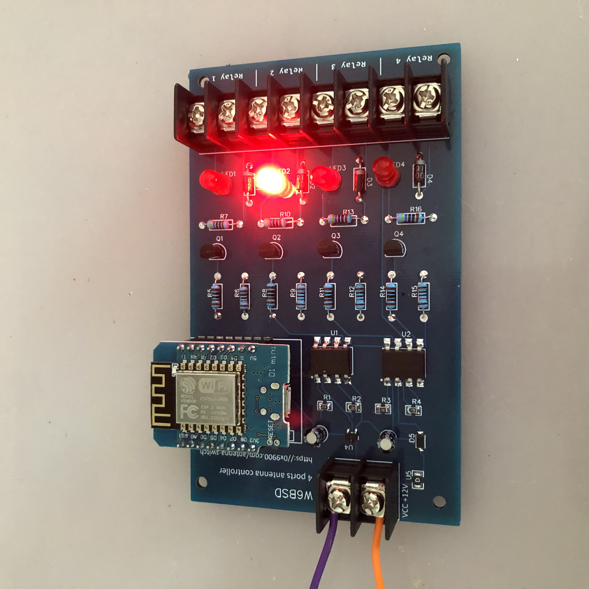
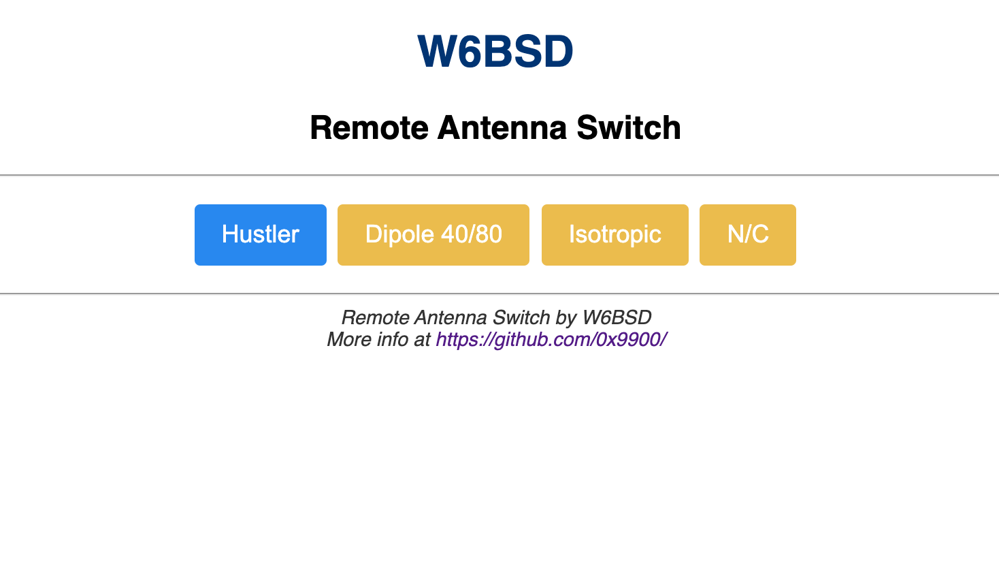

# Remote Antenna Switch

## This work is in progress

This Remote Coax Switch lets you remotely using your home WiFi, switch
up to four HF antennas. The DC power used by the switch is injected
into the coax power using a Bias T. There is no need to run long wires
from your radioshack to the antenna. This switch is also controllable
using the internet. Making it ideal for operating a remote station.

## Switch controller

The controller board host an [ESP8266 Wemos D1][1]
micro-controller. It takes up to 14 volts in input and up to 4
switches can be connected. The antenna controller is programmed in
[MicroPython][2].

The main goal for this controller is to develop an HF antenna switch
but you can use this controller for any other DIY project.

The schematics and PCB can be found on [EasyEDA][3]

## Web Interface

[1]: https://docs.wemos.cc/en/latest/d1/d1_mini.html
[2]: https://micropython.org
[3]: https://easyeda.com/W6BSD/antennaswitch
