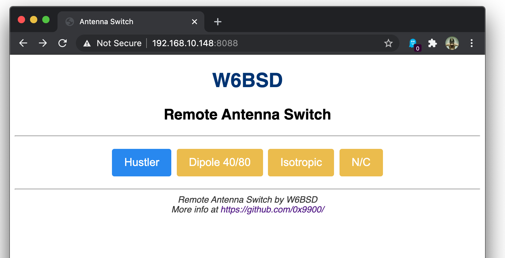

# Remote Antenna Switch

For more information on the Remote Antenna Switch you can visit my
[blog post][1]. The antenna switch can be controlled using a web
browser. You can also use the companion program [MacSwitch][2] giving
a graphical user interface.

I am currently working on that project on my free time. I have been
working on the controller and had to fix some minor issues.

Here is the list of items that I need to work on next:

  - The HF switching. The part handling HF will be on a separate board
    well grounded and shielded from the main controller.
  - The Bias-T power injection. The 12 volt for the relay box
    will be injected through the coaxial cable.
  - Remote control. The antenna switch can be controlled with a
    computer or a phone, but I would like to have a small remote
    control on my desk next to my radio.

## Project

This Remote Coax Switch lets you remotely using your home WiFi, switch
up to four HF antennas. The DC power used by the switch is injected
into the coax power using a Bias T. There is no need to run long wires
from your radioshack to the antenna. This switch is also controllable
using the internet. Making it ideal for operating a remote station.

## Switch controller

The controller board host an [ESP8266 Wemos D1][3]
micro-controller. It takes up to 14 volts in input and up to 4
switches can be connected. The antenna controller is programmed in
[MicroPython][4].

The main goal for this controller is to develop an HF antenna switch
but you can use this controller for any other DIY project.

The schematics and PCB can be found on [EasyEDA][5]

## Controlling the switch

### Using the web Interface

### Using the terminal

The antenna can be selected from the terminal with the following command.
Replace the `1` after the word select with the switch number.

    √ ~ % curl -s http://192.168.10.148:8088/api/v1/select/1 | ppjson
    {
        "port": 1,
        "msg": "Port 1 selected",
        "status": "OK"
    }

You can request the status of all the ports using the following
command. Status `1` means the antenna is selected.

    curl -s http://192.168.10.148:8088/api/v1/ports | ppjson
    {
        "1": {
            "label": "Hustler",
            "status": 1
        },
        "2": {
            "label": "Dipole 40/80",
            "status": 0
        },
        "3": {
            "label": "Isotropic",
            "status": 0
        },
		"4": {
            "label": "N/C",
            "status": 0
        }
    }

## Final integration

This following picture is an illustration of how I use that controller
to switch HF antennas. I am only using three slots on the controller board
only to control three relays. The antenna switch is powered using a
bias-tee.

[1]: https://0x9900.com/remote-controlled-antenna-switch/
[2]: https://github.com/0x9900/MacSwitch
[3]: https://docs.wemos.cc/en/latest/d1/d1_mini.html
[4]: https://micropython.org
[5]: https://easyeda.com/W6BSD/antennaswitch
